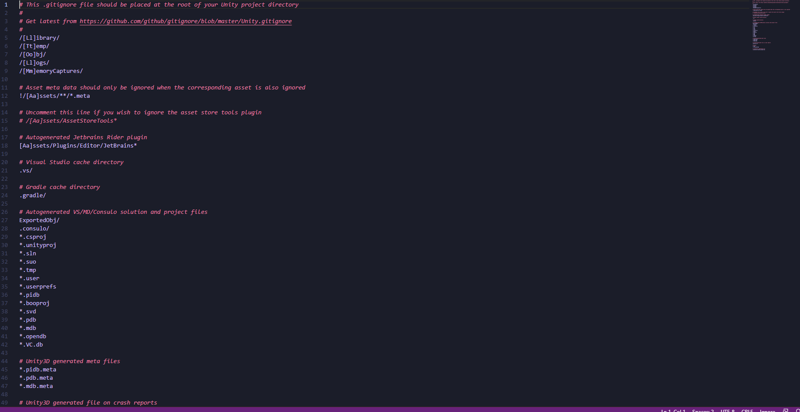

# Intermediate-Graphics-Individual-Assignment-2

Repository has been built, but there isnt an empty build as I imediately got to work on creating the project. Because of that I dont think its fair to doc marks as I have demonstrated the capabilities to full complete the task. Because of that reason, alongside a full build of everything still existing, I would give myself a 1/1 total for this.

The big difference between deffered rendering and forward rendering is the way they process and apply lighting and shading. Forward rendering applys lighting and shading within the process of geometry and fragments. This differs from the post process like deffered shader as the deffered shader wait until the geometry and fragments are processed to apply lighting and shading to them. As shown in the below diagram, the forwards shader is fairly linear with its process rendering everything individually. Forward rendering can be seen with an extra step that take the lighjting out of all the linear processes and combine it into one giant step near the end.  The big reason to use deffered shading is to optimize the shading processes. As an example if the process was simply: render coins or high poly object in front of you that expand into infinity, the theoretical time for the forward rendering could end up going pretty high. this is due to the potentially infinte amounts of face that need to be calculated in the shading portion. By comparison the Deffer shader would cull faces that didnt need to eb rendered in the first place saving a ton of time. While I dont think my explanation was perfect I think this should hit most parts and differences between rendering processes, therefore I think I whould get a 0.9/1

A basic resemblance of the first images was recreated (even: 100839332), alongside a simple ship movement represented by a cube. The shader used was a modified toon shader that added a vertex function to shift the vertical portion of each vertex based on the distance from a given point. This point is determined by the offset added to the shader as well. This results in a toon shaded square wave with a controllable ripple center. On top of that the original wave math ahs been modified to fit with a new rounding system where the final result is either a high or low based on the disatnce to the ripple center. A shown below the center can be adjusted. With the merging of two shaders and extra systems for ripple offsets alongside the full build, I think I added enough to qualify for full marks overall 3/3. Extra notes, while not mentioned or shown (in video), the ship is controlable by WASD, the wave do move, its just hard to see, the water texture also shifts in play.

INSERT CODE SNIPPET 1 ANALYSIS HERE

Two post processing shaders were added to enhance the scene. Bloom was added to pop some colors, namely the blue to overlap the edges of the cubes. On top of that the overall view was pixelated to simulate the retro view that was shown in the image. While the image is not 100% faithful to original, I feel as if the effect added are to improve the look. The pixelation is made by taking samples around a pixel based on the size of the pixelation. On top of that the script attached to the camera automaticatly rounds to makes sure the aspect ratio is maintained and not warped. As for bloom, an extra color was multiplied in to give the bloom itself a little extra color. Both of these small changes add a big overall effect on the final product escpacially the extra colors being added then blened to give a better rounded edge to blend the ground and sea. Overall I would give myself a perfect score, maybe slightly lower due to not having many extra changes and effects in place (so a 3/3 or 2.8/3).

INSERT CODE SNIPPET 2 ANALYSIS HERE
